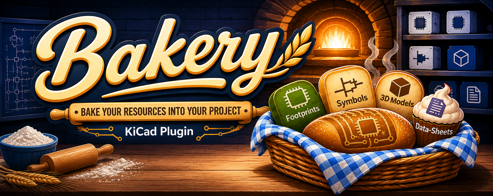
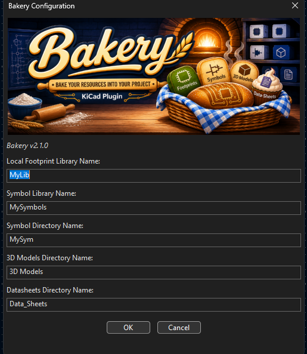
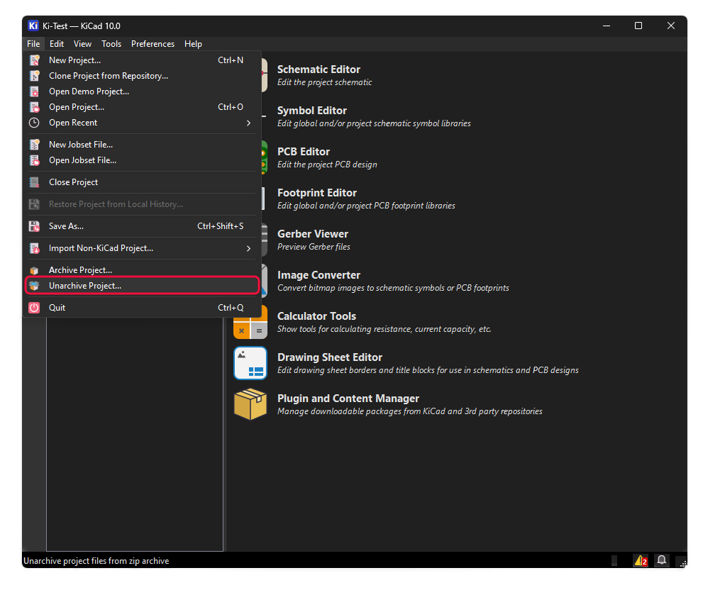

<p align="center">
  <strong>If Bakery has helped you in any way please consider buying me a coffee</strong>
</p>

<p align="center">
<table align="center">
  <tr>
    <td align="center">
      <a href="https://www.buymeacoffee.com/Adrian_West" target="_blank">
        
      </a>
    </td>
    <td align="center">
      
    </td>
  </tr>
</table>
</p>

# Bakery - KiCad Plugin

**Localize all KiCad symbols, footprints, 3D models, and datasheets to project libraries - They get Baked into your project**

---

## ⚠️ **IMPORTANT: Protect Your Design** ⚠️

### **This plugin makes extensive changes to your schematic and PCB files.**

### **Bakery creates a KiCad-compatible ZIP backup before it changes your project.**

**Why?**
- Bakery modifies `.kicad_sch` and `.kicad_pcb` files extensively
- Bakery now supports restoring a previous design with KiCad's built-in **Unarchive Project** command
- Each backup is saved as `<project>-backups/<project>-YYYY-MM-DD_HHMMSS.zip`
- Version control is still recommended for complete history and day-to-day change tracking

**Recommended: put your project under Git before running Bakery:**
```bash
cd /path/to/your/project
git init
git add .
git commit -m "Before Bakery localization"
```

---

## Overview

Bakery is a KiCad plugin that automates the process of copying global library symbols, footprints, 3D models, and datasheets into project-local libraries. The plugin **"bakes in"** all external dependencies, converting references from global libraries to local project files. This ensures:
- **Project portability**: No external library dependencies - everything is baked into your project
- **Version stability**: Libraries won't change if global libraries are updated
- **Self-contained projects**: All files and dependencies are contained in the project folder
- **Complete independence**: Share projects without worrying about missing libraries

## Installation

### Option 1: Via KiCad Plugin Manager (Recommended)

1. Open KiCad
2. Go to **Tools** > **Plugin and Content Manager**
3. Search for "Bakery"
4. Click **Install**

### Option 2: Install from ZIP File

1. Download the latest release ZIP from [GitHub Releases](https://github.com/AdrianWest/Bakery/releases)
2. In KiCad, go to **Tools** > **Plugin and Content Manager**
3. Click **Install from File...**
4. Select the downloaded `Bakery-x.x.x.zip` file
5. Click **Open** to install

### Option 3: Manual Installation

1. Download or clone this repository
2. Copy the `plugins` folder contents to your KiCad plugins directory:
   - **Windows**: `%USERPROFILE%\Documents\KiCad\10.0\scripting\plugins\Bakery\`
   - **Linux**: `~/.kicad/10.0/scripting/plugins/Bakery/`
   - **Linux (Flatpak)**: `~/.var/app/org.kicad.KiCad/data/kicad/10.0/scripting/plugins/Bakery/`
   - **macOS**: `~/Library/Preferences/kicad/10.0/scripting/plugins/Bakery/`

   > **Note (Flatpak):** KiCad installed via Flatpak runs in a sandbox and
   > does not see `~/.kicad/...`. Copy the plugin into the sandboxed data
   > directory shown above, or KiCad will not detect it. After copying,
   > fully quit KiCad (not just close the window) before relaunching so it
   > rescans the plugins folder.
3. Restart KiCad

> **Note:** Bakery currently supports **KiCad 10.x only**. If you are still
> on KiCad 9.x (including Flatpak builds), use the last 9.x-compatible
> release, [v1.1.0](https://github.com/AdrianWest/Bakery/releases/tag/v1.1.0),
> instead of the current release.

## How To Use Bakery

### 1. Prepare Your Project

1. Save your KiCad project, schematic, and PCB.
2. Close any other KiCad windows that have the project open.
3. Confirm that the project is under version control if possible. Bakery also
   creates a timestamped KiCad ZIP backup before making changes.

### 2. Run Bakery

1. Open the project's PCB in **PCB Editor**.
2. Click the  icon in the
   top toolbar, or select **Tools** > **External Plugins** >
   **Bakery - Localize Symbols, Footprints, and 3d Models**.
3. Choose the local library and folder names in the configuration dialog.
4. Confirm the operation and leave KiCad open while Bakery completes.



### Configuration Dialog Fields

These names control the project-local libraries and folders Bakery creates.
The defaults are safe for most projects; change them only if you want different
names in your KiCad project folder.

| Field | What to enter | What Bakery creates or updates |
|-------|---------------|--------------------------------|
| **Local Footprint Library Name** | A KiCad library nickname, such as `MyLib` | A local footprint library folder named `MyLib.pretty` and an `fp-lib-table` entry for it |
| **Symbol Library Name** | A KiCad symbol library nickname, such as `MySymbols` | A local symbol library file named `MySymbols.kicad_sym` and a `sym-lib-table` entry for it |
| **Symbol Directory Name** | A folder name, such as `MySym` or `Symbols` | The folder that stores the local symbol library file |
| **3D Models Directory Name** | A folder name, such as `3D Models` | The folder that stores copied STEP/WRL model files |
| **Datasheets Directory Name** | A folder name, such as `Data_Sheets` | The folder that stores downloaded or copied PDF datasheets |

Click **OK** to start localization, **Cancel** to exit without changes, or
**Help** to open the Bakery GitHub repository.

Bakery will:
   - Create `<project>-backups/<project>-YYYY-MM-DD_HHMMSS.zip`
   - Create local `.pretty` folders for footprints
   - Create local symbol library (`.kicad_sym`) in Symbols directory
   - Create local `3D Models` folder for 3D models
   - Create local `Data_Sheets` folder for datasheets
   - Copy all used symbols, footprints, and their associated 3D models
   - Download datasheets from internet URLs and copy local datasheet files into the project datasheet folder
   - Scan and localize datasheet references from both schematic and PCB files
   - Update `fp-lib-table` and `sym-lib-table` to include local libraries
   - Update references in both PCB and schematic files to point to local libraries
   - Abort before making changes if the project backup cannot be created

### 3. Check the Result

1. Review Bakery's log, warnings, and errors before closing KiCad.
2. Open the schematic and PCB to confirm that symbols and footprints load
   correctly.
3. Open the 3D Viewer to confirm copied 3D models render as expected.
4. The project is now portable: its localized libraries, models, and
   datasheets are stored in the project folder.

## Restore a Previous Design

Bakery backups are standard KiCad ZIP project archives. Restore a previous
design at any time with KiCad's built-in **Unarchive Project** command:

1. Close the current project.
2. In the KiCad Project Manager, select **File** > **Unarchive Project...**.
3. Select the desired ZIP from the project's `<project>-backups` folder.
4. Select a new, empty folder for the restored project. Do not restore over
   the current design until you have confirmed the backup is correct.
5. Open the restored `.kicad_pro` file and verify the schematic and PCB.
6. If it is correct, replace the current project only if needed.

For details, see the official KiCad documentation:
[Project archive and unarchive](https://docs.kicad.org/10.0/en/kicad/kicad.html#project-archive).



## Project Structure After Localization

```
YourProject/
├── YourProject.kicad_pro
├── YourProject.kicad_pcb
├── YourProject.kicad_sch
├── YourProject-backups/      # Timestamped pre-localization project archives
│   └── YourProject-YYYY-MM-DD_HHMMSS.zip
├── fp-lib-table              # Updated with local footprint library
├── sym-lib-table             # Updated with local symbol library
├── MyLib.pretty/             # Local footprint library
│   ├── Footprint1.kicad_mod
│   └── Footprint2.kicad_mod
├── Symbols/                  # Local symbol libraries
│   └── MySymbols.kicad_sym  # Local symbol library
├── 3D Models/                # Local 3D models
│   ├── model1.step
│   └── model2.wrl
└── Data_Sheets/              # Local datasheets
    ├── component1.pdf
    └── component2.pdf
```

## Development

See [.github/copilot-instructions.md](.github/copilot-instructions.md) for development guidelines and architecture details.

### Project Architecture

```
Bakery/
├── __init__.py                 # Plugin registration and metadata
├── bakery_plugin.py            # Main plugin class (ActionPlugin interface)
├── constants.py                # Configuration constants and messages
├── ui_components.py            # Logger window and configuration dialog
├── footprint_localizer.py      # Footprint and 3D model localization
├── symbol_localizer.py         # Symbol localization
├── data_sheet_localizer.py     # Datasheet localization (download/copy/update)
├── library_manager.py          # Footprint library table management
├── sexpr_parser.py             # S-expression parser
├── utils.py                    # Shared utility functions
└── metadata.json               # Plugin metadata for KiCad Plugin Manager
```

## Features

   ✅ **Symbol Localization**: Automatically copies all symbols from global libraries to your project
   
   ✅ **Footprint Localization**: Automatically copies all footprints from global libraries to your project

   ✅ **3D Model Localization**: Copies associated 3D models and updates paths

   ✅ **Datasheet Localization**: Downloads datasheets from internet URLs or copies local PDF files to your project; updates all references to use portable `${KIPRJMOD}` paths

   ✅ **Automatic Reference Updates**: Updates PCB, schematics, and library tables

   ✅ **Dual Scanning**: Scans both PCB and schematic files for complete coverage

   ✅ **Automatic Project Backup**: Creates a KiCad-compatible timestamped ZIP before changing project files

   ✅ **Progress Tracking**: Visual progress bar with step-by-step status

   ✅ **Detailed Logging**: Separate panes for info, warnings, and errors

   ✅ **Configurable**: Choose local library and directory names

   ✅ **Path Safety**: Validates all file operations to prevent data loss

   ✅ **KiCad 10 Support**: Built for KiCad version 10


## Requirements

- KiCad 10.x
- Python 3.x (bundled with KiCad)
- wxPython (bundled with KiCad)

## Configuration

When you run Bakery, you can configure:
- **Local Footprint Library Name**: Name for the local footprint library (default: "MyLib")
- **Symbol Library Name**: Name for the local symbol library file (default: "MySymbols")
- **Symbol Directory Name**: Name for the symbol library directory (default: "Symbols")
- **3D Models Folder**: Name for the 3D models folder (default: "3D Models")
- **Datasheets Directory Name**: Name for the local datasheets folder (default: "Data_Sheets")
- **Automatic Project Backup**: Mandatory and created in `<project>-backups`

## License

GNU General Public License v3.0 - see LICENSE file

## Contributing

Contributions welcome! Please open an issue or pull request.

Please note that this project is released with a [Code of Conduct](CODE_OF_CONDUCT.md). By participating in this project you agree to abide by its terms.

## Roadmap

### Version 2.1.0 - Current Release

- [x] KiCad 10 project support, including projects that still reference 9.x global libraries
- [x] Localization of symbols, footprints, 3D models, and datasheets into project-local libraries
- [x] Collision-safe local names and filenames for symbols, footprints, 3D models, and datasheets
- [x] Mandatory KiCad-compatible, timestamped ZIP backup before localization
- [x] Restore previous designs through KiCad's **File** > **Unarchive Project...** command
- [x] Safe repeat runs that preserve local `${KIPRJMOD}` 3D model paths
- [x] Detection and user-visible warnings for unresolved local symbol references
- [x] Recursive hierarchical-schematic processing and dual PCB/schematic scanning
- [x] Automated unit tests and Windows KiCad 10 functional tests that reopen both the localized PCB and root schematic

### Planned for Future Versions

- [ ] KiCad 11 compatibility review and support
- [ ] Additional localization and recovery improvements based on user feedback
- [ ] Expanded functional-test coverage for new KiCad versions and project configurations

## Testing

### Unit Tests

The unit suite uses Python's built-in `unittest` framework and mocks the
KiCad APIs where necessary. From the repository root:

```powershell
python "Unit Test\run_tests.py"             # Run all unit tests
python "Unit Test\run_tests.py" --verbose   # Show each test name
python "Unit Test\run_tests.py" --list      # List discovered test modules
python "Unit Test\run_tests.py" --coverage  # Write terminal and HTML coverage reports
```

`--coverage` requires the optional `coverage` package:

```powershell
python -m pip install coverage
```

The suite covers the plugin entry point, localization modules, backup and
configuration handling, utilities, library management, and S-expression
parsing. See [Unit Test/README.md](Unit%20Test/README.md) for test-specific
details.

### Automated Functional Tests

The functional suite drives a real **KiCad 10** installation through its UI.
It restores all four fixture projects, installs the plugin, runs Bakery,
checks the localized project files, verifies a second run makes no unintended
changes, and reopens the localized PCB and root schematic in KiCad.

**Requirements**

- Windows with KiCad 10 installed
- Python 3.x
- `pywinauto`, `pywin32`, and `psutil`
- No open `pcbnew.exe` or Bakery plugin process

Install the Python test dependencies once:

```powershell
python -m pip install pywinauto pywin32 psutil
```

From the repository root, run the complete suite or selected fixtures:

```powershell
# Run FT-01 through FT-04
python "Functional Test\functional_suite\run_functional_tests.py"

# Run only selected fixtures while iterating
python "Functional Test\functional_suite\run_functional_tests.py" --fixtures FT-01,FT-03

# Run one localization pass only, without the second-run or PCB/schematic reopen checks
python "Functional Test\functional_suite\run_functional_tests.py" --skip-idempotence --skip-reopen
```

Test workspace files are created under `C:\GIT_HUB\testing`. Each run writes
`junit.xml`, `summary.json`, `environment.json`, and `report.md` to
`C:\GIT_HUB\testing\results\<timestamp>\`. Datasheet download failures and
the fixtures' deliberately missing references are asserted as expected
conditions; unexpected localization, PCB reopen, or schematic reopen failures
cause a nonzero exit code.

See [Functional Test/functional_suite/README.md](Functional%20Test/functional_suite/README.md)
for the fixture matrix, assertions, expected issues, and report details.
